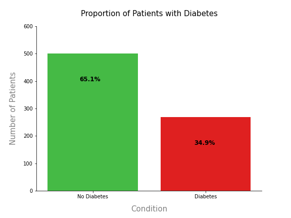
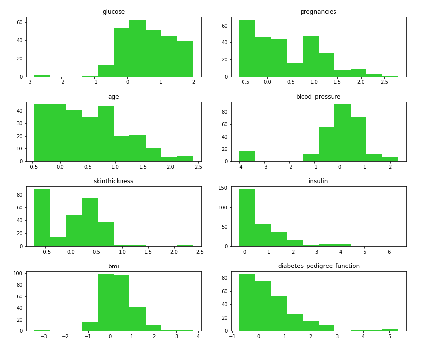
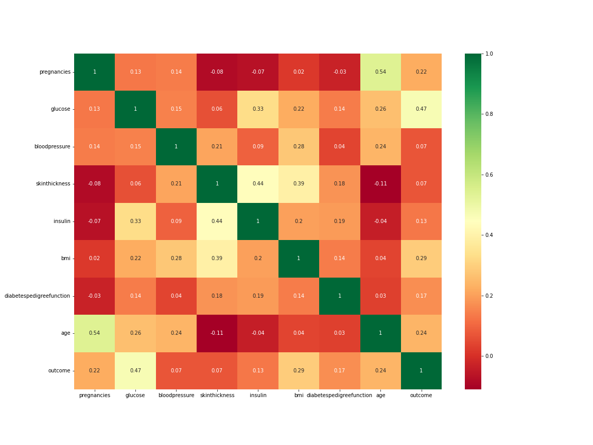
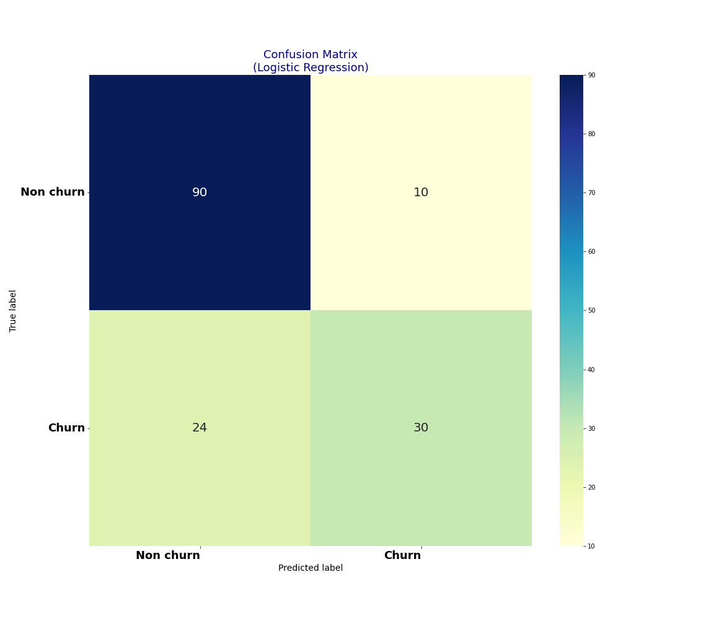
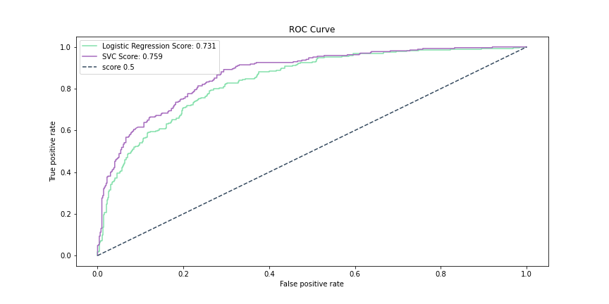

# 🍫 Diabetes Prediction: Project Overview
* End to end project researching the effects personal attributes have on the diagnosis of diabetes.
* Optimised SVC using GridsearchCV and RandomizedSearchCV to reach the best model performance. 
* Deployed Model into production for wider use. See below.  


#### [Use Deployed Model](https://p7-diabetes-model.herokuapp.com/)

## Table of Contents 
[Resources](#resources)<br>
[Data Collection](#DataCollection)<br>
[Data Pre-processing](#DataPre-processing)<br>
[Data Warehousing](#DataWarehousing)<br>
[Exploratory data analysis](#EDA)<br>
[Feature Engineering](#FeatEng)<br>
[ML/DL Model Building](#ModelBuild)<br>
[Model performance](#ModelPerf)<br>
[Model Optimisation](#ModelOpt)<br>
[Model Evaluation](#ModelEval)<br>
[Model Productionisation](#ModelProd)<br>
[Deployment](#ModelDeploy)<br>
[Project Management (Agile | Scrum)](#Prjmanage)<br>
[Project Evaluation](#PrjEval)<br>
[Looking Ahead](#Lookahead)<br>
[Questions | Contact me ](#Lookahead)<br>

<a name="Resources"></a>  

## Resources Used
**Python 3, PostgreSQL** 

[**Anaconda Packages:**](requirements.txt) **pandas numpy pandas_profiling ipywidgets sklearn matplotlib seaborn sqlalchemy kaggle psycopg2 ipykernel flask** <br><br>
Powershell command for installing anaconda packages used for this project  
```powershell
pip install pandas numpy pandas_profiling ipywidgets sklearn matplotlib seaborn sqlalchemy kaggle psycopg2 ipykernel flask 
```

<a name="DataCollection"></a>  

## [Data Collection](Code/P7_Code.ipynb)
Powershell command for data import using kaggle API <br>
```powershell
!kaggle datasets download -d mathchi/diabetes-data-set -p ..\Data --unzip 
```
[Data source link](https://www.kaggle.com/mathchi/diabetes-data-set)
[Data](Data/diabetes.csv)
*  Rows: 768 | Columns: 9
    *   Pregnancies                   
    *   Glucose                      
    *   BloodPressure                 
    *   SkinThickness                 
    *   Insulin                      
    *   BMI                    
    *   DiabetesPedigreeFunction    
    *   Age                          
    *   Outcome                       

<a name="DataPre-processing"></a>  

## [Data Pre-processing](Code/P7_Code.ipynb)
After I had all the data I needed, I needed to check it was ready for exploration and later modelling. I made the following changes and created the following variables:   
*   General NULL and data validity checks  

<a name="DataWarehousing"></a>

## [Data Warehousing](Code/P7_Code.ipynb)
I warehouse all data in a Postgre database for later use and reference.

*   ETL in python to PostgreSQL Database.
*   Formatted column headers to SQL compatibility.  

<a name="EDA"></a>  

## [Exploratory data analysis](Code/P7_Code.ipynb) 
I looked at the distributions of the data and the value counts for the various categorical variables that would be fed into the model. Below are a few highlights from the analysis.
*   34.9% in the dataset have diabetes.



*   There is visually a relationship between the number of pregnancies and diabetes diagnosis. 


*   Boxplots were used to visualise features with outliers. These features will be scaled later before modelling. 


*   I visualised the distribution for those with diabetes


*   All features are generally not strongly correlated 


<!-- <a name="Dataviz"></a>  

## [Data Visualisation & Analytics](https://app.powerbi.com/view?r=eyJrIjoiNDExYjQ0OTUtNWI5MC00OTQ5LWFlYmUtYjNkMzE1YzE2NmE0IiwidCI6IjYyZWE3MDM0LWI2ZGUtNDllZS1iZTE1LWNhZThlOWFiYzdjNiJ9&pageName=ReportSection)
[View Interactive Dashboard](https://app.powerbi.com/view?r=eyJrIjoiNDExYjQ0OTUtNWI5MC00OTQ5LWFlYmUtYjNkMzE1YzE2NmE0IiwidCI6IjYyZWE3MDM0LWI2ZGUtNDllZS1iZTE1LWNhZThlOWFiYzdjNiJ9&pageName=ReportSection)
*   I created an interactive dashboard to deploy the machine learning model to benefit the business.
*   I visualised various key features and highlighted their overall correlation to a customer’s churn.  -->

<!-- <a name="Busintelli"></a>  

## Business Intelligence
On Page 2 of the interactive dashboard, I have provided the stake holders with the new customer names and the customers that are likely to churn due to their characteristics.

*   These customers can be offered subsidised deals and incentives to keep them on
*   Greater engagement with customers could keep some customers on board 
*   Providing quality customer service can also provide customers with long term value and appreciation for the business
*   The complaints team should pay particular attention to complaints from customers who are predicted to churn.
- 96% of unhappy customers don’t complain and 91% of those will simply leave and never come back? -->

<a name="FeatEng"></a>  

## [Feature Engineering](Code/P7_Code.ipynb) 
There was no need to transform the categorical variable(s) into dummy variables as they are all numeric. I also split the data into train and tests sets with a test size of 20%.
*   Using RobustScaler to scale
<!-- *   One Hot encoding to encode values -->
  

<a name="ModelBuild"></a> 

## [ML/DL Model Building](Code/P7_Code.ipynb)

I tried four different models and evaluated them using initially using accuracy_score and then MSE/RMSE. I chose MSE and RMSE because it is sensitive to outliers, punishes larger errors and is relatively easy to interpret.   

I tried four different models:
*   **KN Neighbors Classifier** 
*   **SVC** 
*   **Logistic Regression** 
*   **Random Forest Classifier**


<a name="ModelPerf"></a> 

## [Model performance](Code/P7_Code.ipynb)
The Logistic Regression model outperformed the other approaches on the test and validation sets. 
*   **Logistic Regression** : Accuracy = 77.92% 
*   **SVC** : Accuracy = 75.32% 

<a name="ModelOpt"></a> 

## [Model Optimisation](Code/P7_Code.ipynb)
In this step, I used GridsearchCV and RandomizedSearchCV to find the best parameters to optimise the performance of the model.
Using the best parameters, I improved the SVC model accuracy of SVC by **1.3%**. The Logistic Regression model however saw no increase in accuracy. 

*   **Logistic Regression** : Accuracy = 77.92% | MSE = 0.22 | RMSE =  0.47 (2dp)
*   **SVC** : Accuracy = 77.27%  | MSE = 0.23 | RMSE =  0.48 (2dp)  

<a name="ModelEval"></a> 

## [Model Evaluation](Code/P7_Code.ipynb)
*   A confusion matrix showing the accuracy score of True and False predictions achieved by the model. 

*   Logistic Regression 


*   Support Vector Classification


*   Plotting the ROC Curve gave me some key insight to select the best performing model. Although Logistic regression has a higher accuracy value, I selected the SVC model as the ROC Curve shows the SVC to predict more true positives and true negative which is key for deployment and use in unseen data. 



<a name="ModelProd"></a> 

## [Model Productionisation](Code/P7_Code.ipynb)
*   I used the pickle library to export the model. 
```python
# Dump model into pickle file
pickle.dump(model1, open('.././svc_diabetes.pkl', 'wb'))
```  

<a name="ModelDeploy"></a> 

## [Deployment](app.py)
I built a flask REST API endpoint that was hosted on a local webserver before Heroku deployment. The API endpoint takes in request values and returns prediction of diabetes diagnosis. I also optimised and formatted the frontend using HTML and CSS. 

<a name="Prjmanage"></a> 

## [Project Management (Agile | Scrum)](https://www.atlassian.com/software/jira)
* Resources used
    * Jira
    * Confluence
    * Trello 

<a name="PrjEval"></a> 

## [Project Evaluation](Presentation/P11Presentation.pptx) 
*   WWW
    *   The end-to-end process
    *   Deployment and sharing of work 
*   EBI 
    *   Better project management and planning would have made this project faster
    

<a name="Lookahead"></a> 

## Looking Ahead
*   What next
*   How can a better accuracy score be achieved? 
*   Explore other data sources 

<a name="Questions"></a> 

## Questions | Contact me 
For questions, feedback, and contribution requests contact me
* ### [Click here to email me](mailto:theanalyticsolutions@gmail.com) 
* ### [See more projects here](https://github.com/MattithyahuData?tab=repositories)


