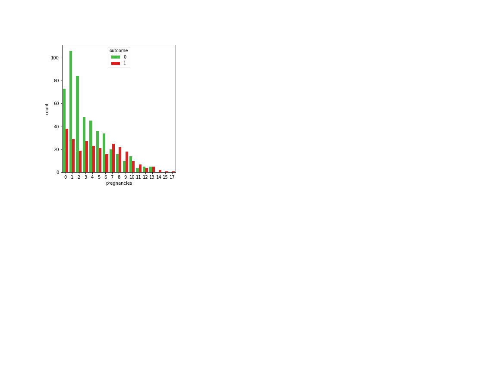
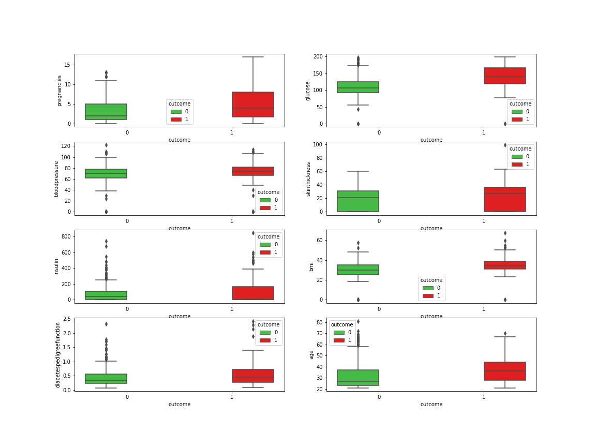
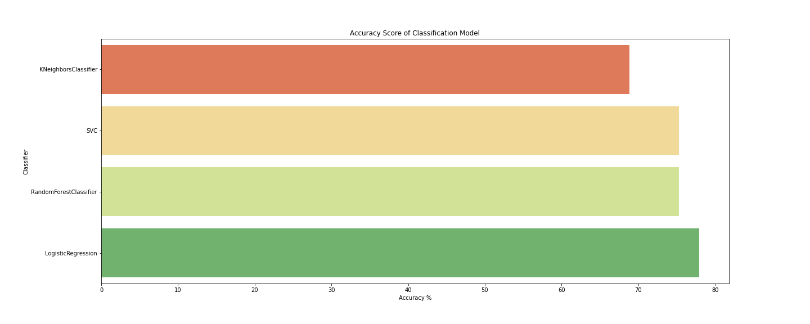

# 🍫 Diabetes Prediction: Project Overview  
* End to end project reasearching the effects personal attributes have on the diagnosis of diabetes.
* Optimised KNN, SVC, Decision Tree, and Random Forest Regressors using GridsearchCV and RandomizedSearchCV to reach the best model. 
* Built a stakeholder facing visual deployment of model to predict churn of new customers 
* Deployed Model in Power BI for Business Intelligence analysis 


[Use Deployed Model](https://p7-diabetes-model.herokuapp.com/)

## Table of Contents 
### *   [Resources](#resources)
### *   [Data Collection](#DataCollection)

<a name="resources"></a>  

## Resources Used
**Python 3, SQL Server, Tableau** 

[**Anaconda Packages:**](requirements.txt) **pandas, numpy, pandas_profiling, ipywidgets, sklearn, matplotlib, seaborn, sqlalchemy, pyodbc, kaggle, pickle, lxml**   


<a name="DataCollection"></a>  

## [Data Collection](Code/P7_Code.ipynb)
Data imported using kaggle API <br>
```
!kaggle datasets download -d mathchi/diabetes-data-set -p ..\Data --unzip 
```
[Data source link](https://www.kaggle.com/mathchi/diabetes-data-set)
[Data](Data/diabetes.csv)
*  Rows: 768 | Columns: 9
    *   Pregnancies                   
    *   Glucose                      
    *   BloodPressure                 
    *   SkinThickness                 
    *   Insulin                      
    *   BMI                    
    *   DiabetesPedigreeFunction    
    *   Age                          
    *   Outcome                       


## [Data Pre-processing](Code/P7_Code.ipynb)
After I had all the data I needed, I needed to check it was ready for exploration and later modelling. I made the following changes and created the following variables:   
*   General NULL and data validity checks  


## [Data Warehousing](Code/P7_Code.ipynb)
I warehouse all data in a SQL Server instance for later use and reference.

*   ETL in python to SQL Server Database.
*   Formatted column headers to SQL compatibility.  

## [Exploratory data analysis](Code/P7_Code.ipynb) 
I looked at the distributions of the data and the value counts for the various categorical variables that would be fed into the model. Below are a few highlights from the analysis.
*   79.63% of customers have churned - Distrubution of features and their effects on churning - Some features have outliers, visualising this allows for greater clarifty on the extent. 




*   I looked at the correlation the features have


## [Data Visualisation & Analytics](https://app.powerbi.com/view?r=eyJrIjoiNDExYjQ0OTUtNWI5MC00OTQ5LWFlYmUtYjNkMzE1YzE2NmE0IiwidCI6IjYyZWE3MDM0LWI2ZGUtNDllZS1iZTE1LWNhZThlOWFiYzdjNiJ9&pageName=ReportSection)
[View Interactive Dashboard](https://app.powerbi.com/view?r=eyJrIjoiNDExYjQ0OTUtNWI5MC00OTQ5LWFlYmUtYjNkMzE1YzE2NmE0IiwidCI6IjYyZWE3MDM0LWI2ZGUtNDllZS1iZTE1LWNhZThlOWFiYzdjNiJ9&pageName=ReportSection)
*   I created an interactive dashboard to deploy the machine learning model to benefit the business.
*   I visualised various key features and hihglighted their overall correlation to a customers churn. 

## Business Intelligence
On Page 2 of the interactive dashboard I have provided the stake holders with the new customer names and the customers that are likely to churn due to their characteristics.

*   These customers can be offered subsidised deals and incentives to keep them on
*   Greater engagement with customers could keep some customers on board 
*   Providing quality customer service can also provide customers with long term value and appreciation for the business
*   The complaints team should pay particular attention to complaints from customers who are predicted to churn.
- 96% of unhappy customers dont complain  and 91% of those will simply leave and never come back?

## [Feature Engineering](Code/P2_Code.ipynb) 
I transformed the categorical variable(s) 'geography' and 'gender' into dummy variables. I also split the data into train and tests sets with a test size of 20%.
*   One Hot encoding to encode values
*   Using RobustScaler to scale  

## [ML/DL Model Building](Code/P11_Code.ipynb)

I tried eight different models and evaluated them using initially using accuracy_score and then MSE/RMSE. I chose MSE and RMSE because it is sensitive to outliers, punishes larger errors and is relatively easy to interpret.   

I tried eight different models:
*   **KN Neighbors Classifier** 
*   **Linear SVC** 
*   **Decision Tree Classifier** 
*   **Random Forest Classifier**
*   **XGB Classifier** 
*   **AdaBoost Classifier**  
*   **Gaussian NB** 
*   **Quadratic Discriminant Analysis** 



## [Model performance](Code/P11_Code.ipynb)
The Quadratic Discriminant Analysis model outperformed the other approaches on the test and validation sets. 
*   **Quadratic Discriminant Analysis** : Accuracy = 96% 

## [Model Optimisation and Evaluation](Code/P11_Code.ipynb)
In this step, I used GridsearchCV to find the best parameters to optimise the performance of the model.
Using the best parameters, I improved the model accuracy by **1%**

*   **Quadratic Discriminant Analysis** : Accuracy = 97% | MSE = 0.03 | RMSE = 0.17 (2dp)

## [Deployment](https://app.powerbi.com/view?r=eyJrIjoiNDExYjQ0OTUtNWI5MC00OTQ5LWFlYmUtYjNkMzE1YzE2NmE0IiwidCI6IjYyZWE3MDM0LWI2ZGUtNDllZS1iZTE1LWNhZThlOWFiYzdjNiJ9&pageName=ReportSection)
I built a flask REST API endpoint that was hosted on a local webserver before AWS EC2 deployment. The API endpoint takes in a request value; height and weight and returns predicted BMI index. I also optimised and formatted the frontend using HTML and CSS. 

## [Model Evaluation](Code/P11_Code.ipynb)
*   A confusion matrix showing the accuracy score of 97.25% achieved by the model. 


## [Project Evaluation](Presentation/P11Presentation.pptx) 
*   WWW
    *   The end-to-end process
    *   Deployment and sharing of work 
*   EBI 
    *   Better project management and planning would have made this project faster
    *   Explore GitHub pages deployment through AWS 

## [Project Management (Agile | Scrum)](https://www.atlassian.com/software/jira)
* Resources used
    * Jira
    * Confluence
    * Trello 

## Questions and See more projects    

* ### [See more projects here](https://github.com/MattithyahuData?tab=repositories)
* ### [Contact me here](mailto:theanalyticsolutions@gmail.com) 

